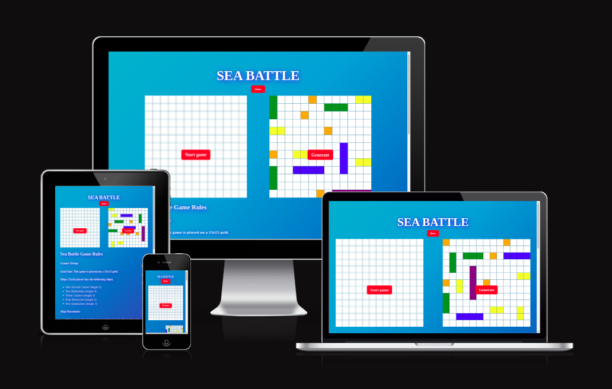
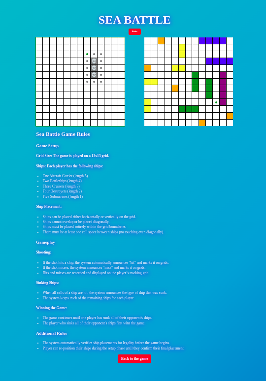
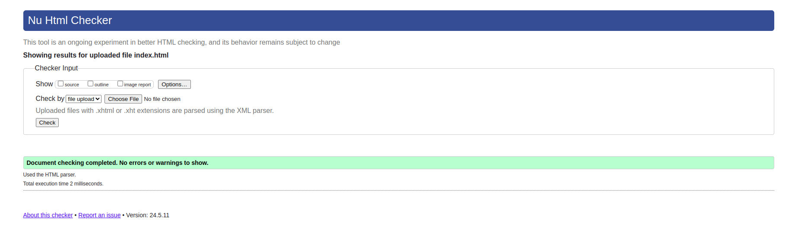
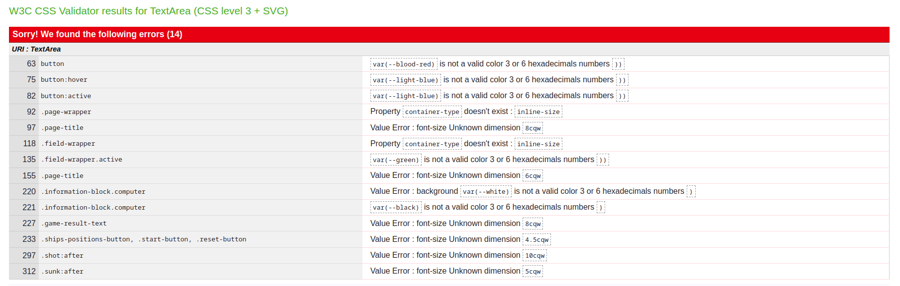
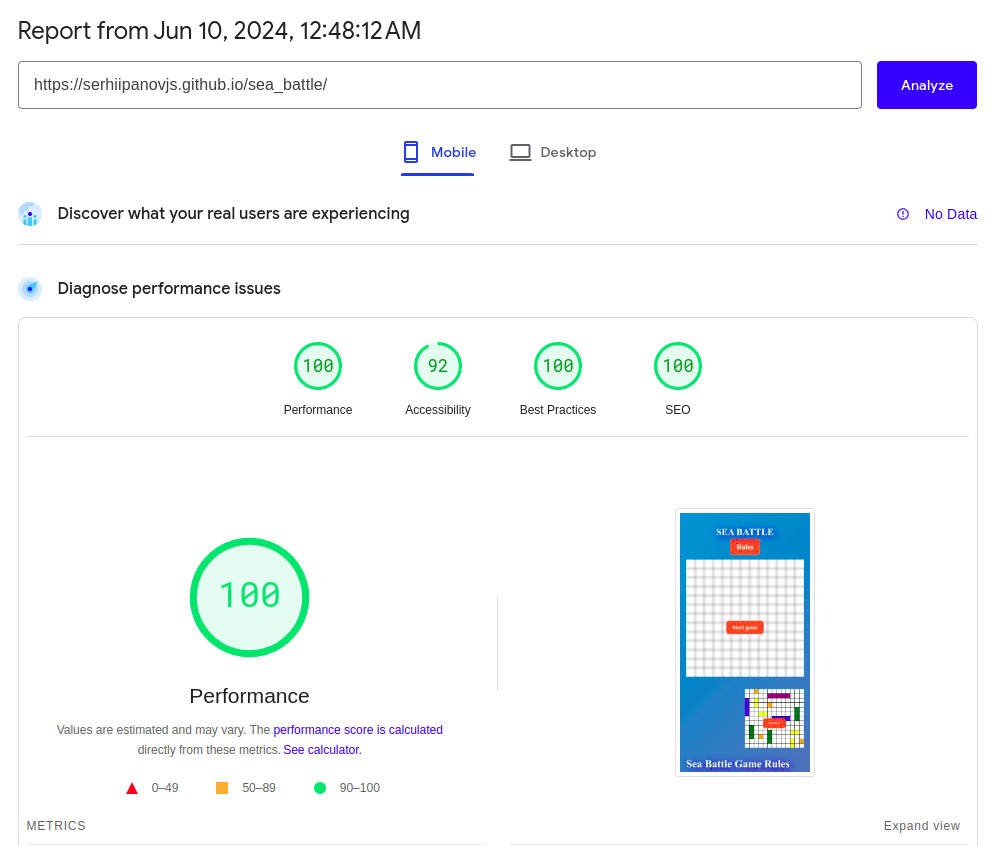
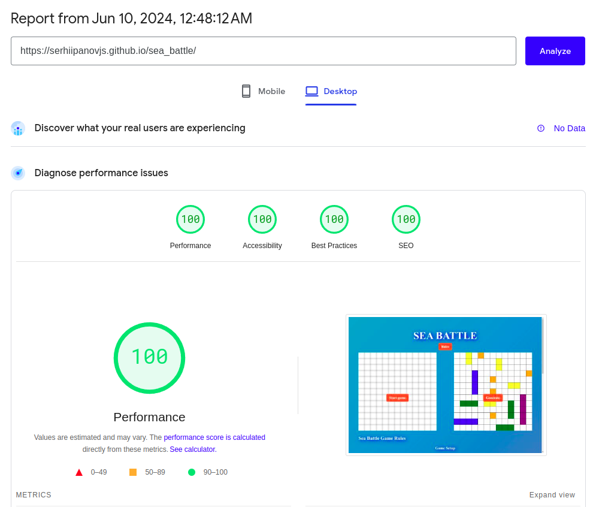
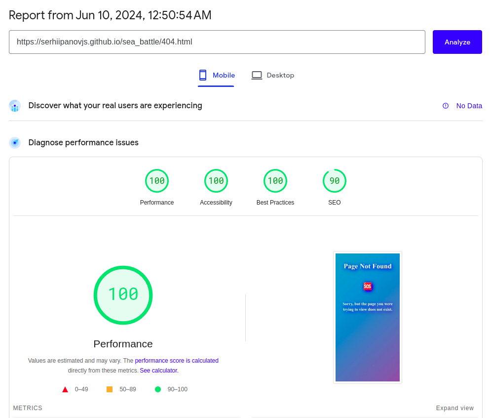
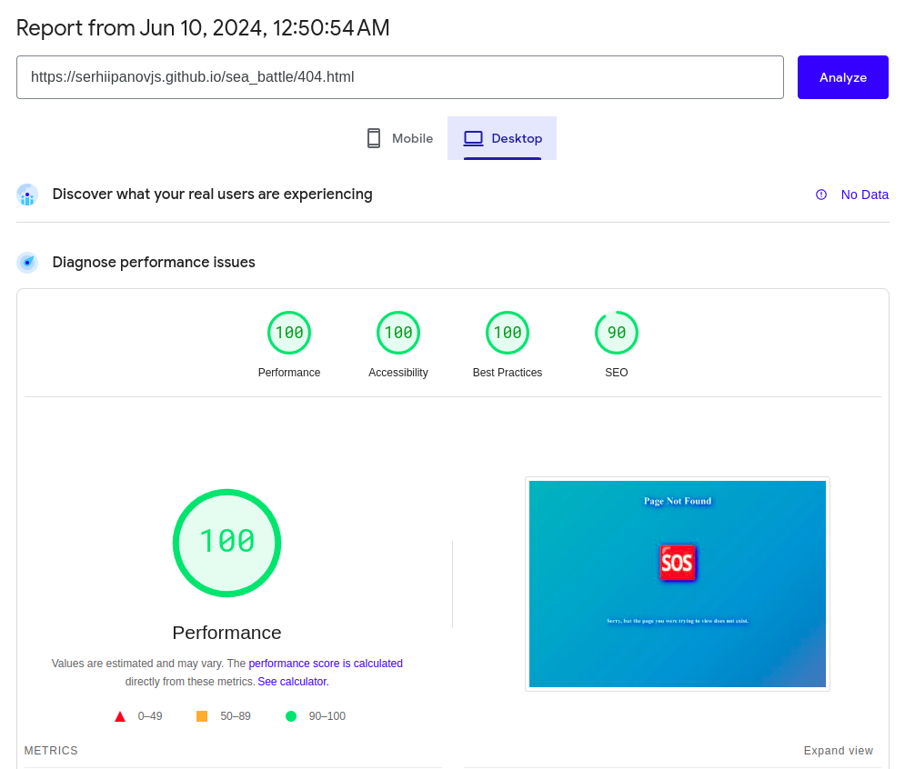

# Sea Battle

Sea Battle is a classic battleship game where you can play against the computer. The objective is to sink all of the
opponent's ships before they sink yours.

[Sea Battle Live Site](https://serhiipanovjs.github.io/sea_battle/)

## Table of Contents

- [Features](#features)
- [Existing Features](#existing-features)
- [Usage](#usage)
- [User Experience](#user-experience)
- [Screenshots](#screenshots)
- [Technologies](#technologies)
- [Testing](#testing)
- [Deployment](#deployment)
- [Acknowledgements](#acknowledgements)

## Features

- Interactive gameplay with a simple and intuitive interface.
- Play against the computer with adjustable difficulty levels.
- Real-time updates on the game status.
- Animations to enhance the gaming experience.

## Existing Features

### Game Setup

- **Random Placement:** Automatically place ships randomly on the grid.

### Gameplay

- **Turn-Based Play:** Alternate turns between the player and the computer.
- **Attack Grid:** Click on the opponent's grid to launch attacks and reveal hits or misses.
- **Real-Time Feedback:** Immediate visual and audio feedback for hits, misses, and ship sinking.

### Endgame

- **Victory and Defeat Screens:** Display celebratory or defeat messages at the end of the game.

## Usage

- Use the game interface to place your ships on the grid.
- Start the game and take turns with the computer to attack the opponent's grid.
- The game ends when all ships of one player are sunk.

## User Experience

Sea Battle is designed to provide an engaging and enjoyable user experience. Here are some key aspects of the user
experience:

- **Easy Setup:** Users can quickly start a game with minimal setup. The intuitive interface guides users through ship
  placement and game initiation.
- **Interactive Gameplay:** Players interact with a visually appealing grid where they can easily place ships and select
  targets. Clickable elements provide immediate feedback, making the game engaging and responsive.
- **Real-Time Feedback:** Users receive instant feedback on their actions, such as successful hits or misses, with
  visual and audio cues enhancing the experience.
- **Victory Celebrations:** Winning a game triggers celebratory, providing a satisfying conclusion to the game.

The overall design focuses on simplicity and enjoyment, ensuring that users can easily understand and enjoy the game
without a steep learning curve.

## Screenshots

## Technologies

- Frontend: HTML, CSS, JavaScript

## Testing

Testing is essential to ensure the quality and functionality of the Sea Battle game. Here are the testing strategies:

### Manual Testing:

- **Game Setup:**
  - Ensure all ships can be placed on the grid.
  - Verify the random placement of ships works correctly.
  - Confirm ships cannot overlap or be placed outside the grid.
- **Gameplay:**
    - Check that turns alternate correctly between the player and the computer.
    - Ensure hits, misses, and ship sinking are displayed correctly.
    - Verify that the game ends when all ships of one player are sunk.
- **User Interface:**
    - Ensure all interactive elements respond correctly to user actions.
    - Verify that animations work as expected.

### Validator Testing:
- **HTML:**

| File                       | Screenshot                                                         | Passed / Notes  |
|----------------------------|--------------------------------------------------------------------|-----------------|
 Homepage - index.html      |         | Yes - no errors |
 404 page - 404.html        |                  | Yes - no errors |

- **CSS:**

| Filename  | Screenshot                                   | Notes                                                               |
|-----------|----------------------------------------------|---------------------------------------------------------------------|
 style.css |  | Jigsaw unsupport hsl color scheme and container query length units. |

- **JS:**

| Filename  | Notes                                                                                                                                                                                                                                                                       |
|-----------|------------------------------------------------------------------------------------------------------|
 index.js | There are 58 functions in this file. Function with the largest signature take 6 arguments, while the median is 1. Largest function has 57 statements in it, while the median is 1. The most complex function has a cyclomatic complexity value of 14 while the median is 2. |

- **Lighthouse Testing:**

| File                       | Screenshot                                                                         | Format  | Passed |
|----------------------------|------------------------------------------------------------------------------------|---------|--------|
 Homepage - index.html      |          | Mobile  | Yes    |
 Homepage - index.html      |         | Desktop | Yes    |
 404 page - 404.html        |                   | Mobile  | Yes    |
 404 page - 404.html        |                  | Desktop | Yes    |

## Deployment

- The site was deployed to GitHub pages. The steps to deploy are as follows:
    - In the GitHub repository, navigate to the Settings tab
    - From the source section drop-down menu, select the Master Branch
    - Once the master branch has been selected, the page will be automatically refreshed with a detailed ribbon display
      to indicate the successful deployment.

The live link can be found here - https://serhiipanovjs.github.io/sea_battle/

## Acknowledgements

Sea Battle is based on the classic Battleship game. For more information about the original game,
visit [the Wikipedia page](https://en.wikipedia.org/wiki/Battleship_(game)).

Note: I am not the inventor of this game. I have taken an already invented idea and created this digital version of the
classic Battleship game.